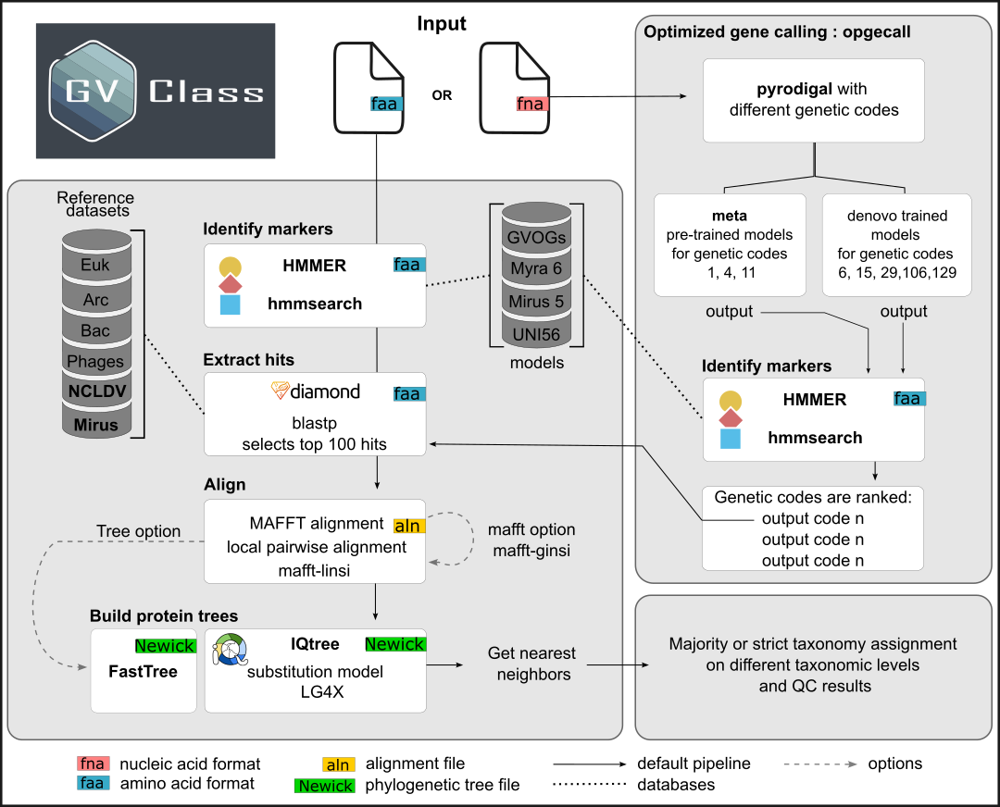

<p align="center">
  
</p>

_version 1.0 8 July 2024_

Giant viruses are abundant and diverse and frequently found in environmental microbiomes. GVClass assigns taxonomy to putative giant virus contigs or metagenome assembled genomes ([GVMAGs](https://doi.org/10.1038/s41586-020-1957-x)). It uses a conservative approach based on the consensus of single protein trees built from giant virus orthologous groups ([GVOGs](https://doi.org/10.1371/journal.pbio.3001430)), additional Mirusvirus, Mryavirus and Poxvirus hallmark genes and cellular single copy panorthologs. Genome completeness and contamination is then estimated based on copy numbers of a larger set of genes typically conserved in single copy at order-level.

## Running GVClass

### Overview of the GVClass framework

<p align="center">
  
</p>

### Input Requirements

* Input is a directory that contains single contigs or MAGs as nucleic acid (fna) or proteins (faa)
* File extensions .fna or .faa
* Recommended length for assembly size is 50kb, but at least 20kb
* No special characters (".", ";", ":") in filebase name, "\_" or "-" are okay
* Recommended sequence header format if faa provided: <filenamebase>|<proteinid>
* Input will be checked and reformatted if necessary

### Running via IMG/VR
* Upload you metagenome assembled genome or single contig to [IMG/VR](https://img.jgi.doe.gov/vr/) using the GVClass feature

### Running with Docker / Apptainer container

Using containers is the recommended way of running GVClass.

#### Apptainer

* Use the provided `gvclass_apptainer.sh` script. The `querydir` should be located under the current working directory. For testing, use the `example` dir (available in this repository) as the `querydir`. 

```
bash gvclass_apptainer.sh <querydir> <n processes>
```

* Alternatively, run Apptainer directly:

```bash
PROCESSES=<number of processes, e.g. 8>
QUERYDIR=<dir with query genomes, e.g. example>

apptainer run docker://docker.io/doejgi/gvclass:latest \
  snakemake --snakefile /gvclass/workflow/Snakefile \
           -j $PROCESSES \
           --use-conda \
           --conda-frontend mamba \
           --conda-prefix /gvclass/.snakemake/conda \
           --config querydir="$QUERYDIR" \
           database_path="/gvclass/resources"
```

#### Docker

* Use the provided `gvclass_docker.sh` script. The `querydir` should be located under the current working directory. For testing, use the `example` dir (available in this repository) as the `querydir`.

```
bash gvclass_docker.sh <querydir> <n processes>
```

* Alternatively, run Docker directly:

```bash
PROCESSES=<number of processes, e.g. 8>
QUERYDIR=<dir with query genomes, e.g. example>

docker run -v $(pwd):$(pwd) -w $(pwd) doejgi/gvclass:latest \
  snakemake --snakefile /gvclass/workflow/Snakefile \
           -j $PROCESSES \
           --use-conda \
           --conda-frontend mamba \
           --conda-prefix /gvclass/.snakemake/conda \
           --config querydir="$QUERYDIR" \
           database_path="/gvclass/resources"
```

#### Shifter

* Use the provided `gvclass_shifter` script. The `querydir` should be located under the current working directory. For testing, use the `example` dir (available in this repository) as the `querydir`.

```
bash gvclass_shifter.sh <querydir> <n processes>
```

* Alternatively, run Shifter directly:

```bash
PROCESSES=<number of processes, e.g. 8>
QUERYDIR=<dir with query genomes, e.g. example>

shifterimg pull docker:doejgi/gvclass:latest
shifter --image=docker:doejgi/gvclass:latest  \
  snakemake --snakefile /gvclass/workflow/Snakefile \
           -j $PROCESSES \
           --use-conda \
           --conda-frontend mamba \
           --conda-prefix /gvclass/.snakemake/conda \
           --config querydir="$QUERYDIR" \
           database_path="/gvclass/resources"

```

### Manual installation and running with Snakemake

* First, install a conda environment with snakemake, check here: https://snakemake.readthedocs.io/en/stable/getting_started/installation.html
* Clone the repository
```
git clone --recurse-submodules https://github.com/NeLLi-team/gvclass
```

* Activate snakemake (8.14.0) conda environment, install cython and pyrodigal
```
conda config --set channel_priority flexible  # gvclass needs flexible priorities
pip install cython
cd gvclass/workflow/scripts/
pip install --user ./pyrodigal
cd ../../
```
* Test GVClass using the provided giant virus assemblies
```
snakemake -j 24 --use-conda --config querydir="example"
```
* If this completes successfully, run it using your own directory of query genomes
```
snakemake -j <number of processes> --use-conda --config querydir="<path to query dir>"
```

#### Advanced Settings

* Config file allows to specify options for MAFFT (default is mafft-linsi), iqtree (default) or fasttree
* fast_mode (default) can be set to False in config file, in that case single protein trees are also built for all conserved order-level marker genes
* These parameters can also be passed on the command line via the `--config` command line option. E.g., `--config querydir=example treeoption=fasttree`.

## Interpretation of the results
* The classification result is summarized in a tab separated file in a subdir "results" in the the query dir

### Gene calling
* Different genetic codes are tested and evaluated based on hmmsearch using the general models
* Genetic code that yields the largest number of matches to general models with the highest average bitscore and the highest coding density is selected

### Taxonomy assignments
* Taxonomy assignments are provided on different taxonomic levels
* To yield an assignments all nearest neighbors in GVOG phylogenetic trees have to be in agreement

### Contamination
* Giant virus genomes typically have less than 10 out of a set of 56 universal cellular housekeeping genes (UNI56). Higher UNI56 counts indicate cellular contamination, or giant virus sequences that are located on host contigs.
  * UNI56u (unique counts), UNI56t(total counts), UNI56df (duplication factor) are provided and can be used for further quality filtering
* Giant virus genomes typically have a duplication factor of GVOG7 and  GVOG9 of below 3. Higher GVOG7 duplication factors indicate the presence mixed viral populations.
  * GVOG8u, GVOG4u (unique counts), GVOG8t, GVOG4t (total counts), GVOG8df (duplication factor) are provided and can be used for further quality filtering
     * GVOG8df < 2 and order_dup < 1.5: low chance of representing mixed bin [high quality]
     * GVOG8df 2-3 and order_dup 1.5-2: medium chance of representing mixed bin [medium quality]
     * GVOG8df >3 and order_dup >3: high chance of representing mixed bin [low quality]
### Completeness
* Genome completeness estimate based on count of genes conserved in 50% of genomes of the respective Nucleocytoviricota order. 
  * \< 30%: low completeness  [low quality]
  * 30-70%: medium completeness [medium quality]
  * \> 70% high completeness [high quality]

## Benchmarking

* Will be provided soon

## Citation

https://www.biorxiv.org/content/10.1101/2024.08.15.607234v1

## Requested updates

* Add Egoviruses and Proculoviruses

## References
1. [Schulz F, Roux S, Paez-Espino D, Jungbluth S, Walsh DA, Denef VJ, McMahon KD, Konstantinidis KT, Eloe-Fadrosh EA, Kyrpides NC, Woyke T. Giant virus diversity and host interactions through global metagenomics. Nature. 2020 Feb;578(7795):432-6.](https://doi.org/10.1038/s41586-020-1957-x)
2. [Aylward FO, Moniruzzaman M, Ha AD, Koonin EV. A phylogenomic framework for charting the diversity and evolution of giant viruses. PLoS biology. 2021 Oct 27;19(10):e3001430.](https://doi.org/10.1371/journal.pbio.3001430)

## Acknowledgements
GVClass was developed by the [New Lineages of Life Group](https://jgi.doe.gov/our-science/scientists-jgi/new-lineages-of-life/) at the DOE Joint Genome Institute supported by the Office of Science of the U.S. Department of Energy under contract no. DE-AC02-05CH11231.


