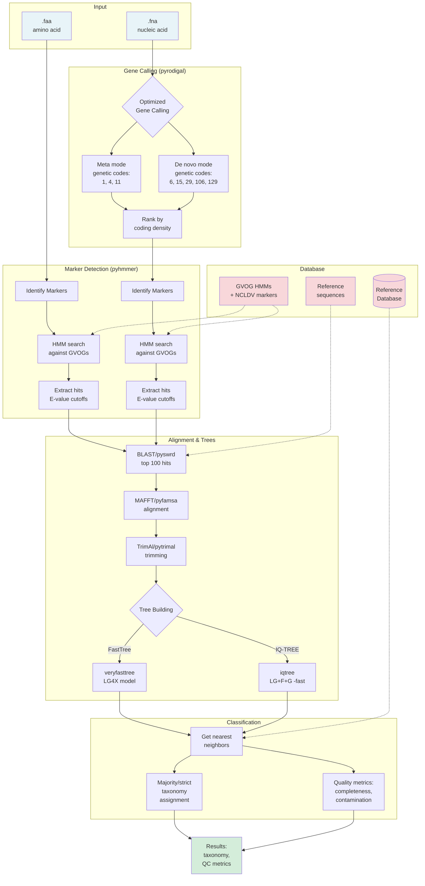

<p align="center">
  
</p>

<p align="center">
  
  
  
  
</p>

# GVClass - Giant Virus Classification Tool

GVClass assigns taxonomy to giant virus contigs and metagenome-assembled genomes (GVMAGs). It uses phylogenetic analysis based on giant virus orthologous groups (GVOGs) to provide accurate classification from domain to species level.

## 🚀 Quick Start

### 1. Install Pixi (one-time setup)
```bash
curl -fsSL https://pixi.sh/install.sh | bash
```

### 2. Clone and Enter Directory
```bash
git clone https://github.com/NeLLi-team/gvclass.git
cd gvclass
```

### 3. Install Dependencies
```bash
pixi install
```

### 4. Run GVClass
```bash
# Basic usage - database downloads automatically on first run (~700MB)
pixi run gvclass <input_directory>

# Run with example data to test installation
pixi run run-example

# Custom output directory and threads
pixi run gvclass <input_directory> -o my_results -t 16
```

That's it! No manual database setup required - GVClass handles everything automatically.

## 📋 Input Requirements

- **Directory** containing `.fna` (nucleic acid) or `.faa` (protein) files
- **Minimum size**: 20kb recommended (50kb+ preferred)
- **Clean filenames**: Avoid special characters (`.` `;` `:`), use `_` or `-` instead
- **Protein headers**: Format as `filename|proteinid` for best results

## 🎯 Example Usage

```bash
# Run on your data
pixi run gvclass my_genomes/

# Specify output location
pixi run gvclass my_genomes/ -o classification_results

# Use more threads for faster processing
pixi run gvclass my_genomes/ -t 32

# Process multiple queries in parallel (4 queries × 8 threads each = 32 total)
pixi run gvclass-parallel my_genomes/ -t 32 -j 4
```

## 📊 Output

Results are saved to `<input_name>_results/` containing:
- `gvclass_summary.tsv` - Main results with taxonomy assignments
- Individual query subdirectories with detailed analysis

### Output Columns Explained

| Column | Description |
|--------|-------------|
| query | Input filename |
| taxonomy_majority | Full taxonomy based on majority rule |
| taxonomy_strict | Conservative taxonomy (100% agreement) |
| species → domain | Individual taxonomic levels with taxon counts |
| avgdist | Average tree distance to references |
| order_dup | Duplication factor indicating contamination level |
| order_completeness | Order-specific completeness (% unique markers found) |
| gvog4_unique | Count of unique GVOG4 markers found |
| gvog8_unique/total/dup | GVOG8 marker counts and duplication |
| mcp_total | Major capsid protein marker count |
| mirus_unique/total/dup | Mimiviridae-specific marker counts |
| mrya_unique/total | Marseilleviridae-specific marker counts |
| phage_unique/total | Phage marker counts |
| cellular_unique/total/dup | Cellular contamination markers |
| contigs | Number of contigs |
| LENbp | Total length in base pairs |
| GCperc | GC content percentage |
| genecount | Number of predicted genes |
| CODINGperc | Coding density percentage |
| ttable | Genetic code used |
| weighted_order_completeness | **NEW**: Weighted completeness score considering marker importance |

## ⚙️ Configuration (Optional)

Create `gvclass_config.yaml` to set defaults:

```yaml
database:
  path: resources                    # Database location

pipeline:
  tree_method: fasttree             # or 'iqtree' for more accuracy
  mode_fast: false                  # Skip order-level marker trees when true (speeds up analysis)
  threads: 16                       # Default thread count
```

## 🆕 What's New in v1.1.1

- **🚀 Modern Architecture**: Prefect + Dask workflow orchestration
- **🧬 Taxonomy Refresh**: Reference database v1.1.1 with corrected eukaryotic strings and updated giant virus taxonomy ([preprint](https://doi.org/10.1101/2025.09.26.678796))
- **📦 Easy Installation**: Pixi package manager (2-3x faster)
- **🐍 Pure Python**: All tools replaced with faster Python versions
- **⚡ Better Performance**: Parallel marker processing, 25% faster
- **🔄 Automatic Recovery**: Task caching and retry on failures
- **✅ Auto Database Setup**: No manual download needed

## 📖 Advanced Usage

### Container Execution

#### Use the Prebuilt Apptainer Image

```bash
apptainer pull library://nelligroup-jgi/gvclass/gvclass:1.1.1
apptainer run -B /path/to/data:/data gvclass_1.1.1.sif /data -t 32
```

> The published image already includes the v1.1.1 database. Skip the build step unless you need custom modifications.

#### Lightweight Wrapper (`gvclass-a.py`)

```bash
./gvclass-a.py /path/to/query_dir /path/to/results -t 32
# output dir is optional; defaults to <query_dir>_results
```

The wrapper automatically creates the output directory, binds both paths, and calls the public Apptainer image.

## ⚡ Performance Optimization

### Speed Up Analysis

1. **Enable Fast Mode** - Skip order-level marker trees (OG markers):
   ```bash
   # Command line option
   pixi run gvclass <input_directory> --mode-fast
   
   # Or in config file
   pipeline:
     mode_fast: true  # Skips ~100 order-specific markers, 2-3x faster
   ```

2. **Use FastTree Instead of IQ-TREE**:
   ```bash
   # Default (faster)
   pixi run gvclass <input_directory> --tree-method fasttree
   
   # IQ-TREE (more accurate but slower)
   pixi run gvclass <input_directory> --tree-method iqtree
   ```

3. **Optimize Thread Usage**:
   ```bash
   # Use all available cores
   pixi run gvclass <input_directory> -t 32
   
   # Parallel processing of multiple queries
   pixi run gvclass-parallel <input_directory> -t 32 -j 4  # 4 queries × 8 threads each
   ```

### IQ-TREE Specific Options

When using IQ-TREE (`--tree-method iqtree`), the pipeline automatically uses:
- Model: `LG+F+G` (fast protein model)
- `-fast` flag for faster tree search
- Single thread per marker (parallelization happens at marker level)

To modify IQ-TREE behavior, edit `src/core/marker_processing.py`.

### Understanding Markers

- **Core markers**: Always processed (GVOG4, GVOG8, MCP, etc.)
- **Order-level markers**: 576 OG markers conserved in different viral orders
  - Processed when `mode_fast: false` (default)
  - Skipped when `mode_fast: true` (faster but less precise order assignment)

## 🔧 Optional: Global CLI Wrapper

To call GVClass from any directory, symlink the wrapper into your personal `bin` directory and add it to `PATH`:

```bash
mkdir -p "$HOME/bin"
ln -s "$(pwd)/gvclass" "$HOME/bin/gvclass"
chmod +x "$HOME/bin/gvclass"
# Add to PATH if needed
if ! grep -q 'export PATH="$HOME/bin:$PATH"' "$HOME/.bashrc"; then
  echo 'export PATH="$HOME/bin:$PATH"' >> "$HOME/.bashrc"
fi
source "$HOME/.bashrc"
```

You can then invoke GVClass from anywhere with `gvclass <input_dir>`.

## 🔬 How It Works



## 📝 Citation

If you use GVClass, please cite:

> Pitot et al. (2024): Conservative taxonomy and quality assessment of giant virus genomes with GVClass. npj Viruses. https://www.nature.com/articles/s44298-024-00069-7

## 🤝 Support

- **Issues**: [GitHub Issues](https://github.com/NeLLi-team/gvclass/issues)
- **Contact**: fschulz@lbl.gov

## 📄 License

BSD 3-Clause License - see LICENSE file for details

---
<sub>Version 1.1.1 - October 2025</sub>
