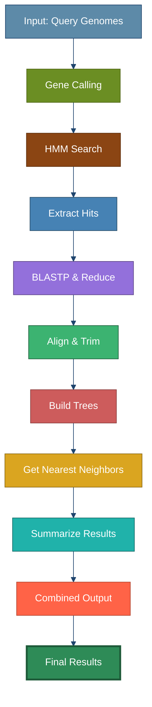

```mermaid
%%{init: {'theme': 'base', 'themeVariables': { 'primaryColor': '#f4f4f4', 'primaryTextColor': '#333', 'primaryBorderColor': '#ddd', 'lineColor': '#666', 'secondaryColor': '#f0f0f0', 'tertiaryColor': '#fff' }}}%%
flowchart LR
    subgraph Input
        A[Query Genomes]
    end

    subgraph Processing
        B[Gene Calling]
        C[HMM Search]
        D[Extract Hits]
        E[BLASTP]
        F[Alignment]
        G[Tree Building]
        H[Nearest Neighbor Analysis]
    end

    subgraph Analysis
        I[Taxonomy Assignment]
        J[Completeness Estimation]
        K[Contamination Assessment]
    end

    subgraph Output
        L[Summary Files]
        M[Combined Results]
        N[Visualization]
    end

    A --> B
    B --> C
    C --> D
    D --> E
    E --> F
    F --> G
    G --> H
    H --> I
    H --> J
    H --> K
    I --> L
    J --> L
    K --> L
    L --> M
    M --> N

    classDef inputClass fill:#e1f5fe,stroke:#01579b,color:#01579b
    classDef processClass fill:#f9fbe7,stroke:#827717,color:#827717
    classDef analysisClass fill:#fff3e0,stroke:#e65100,color:#e65100
    classDef outputClass fill:#e8f5e9,stroke:#1b5e20,color:#1b5e20

    class A inputClass
    class B,C,D,E,F,G,H processClass
    class I,J,K analysisClass
    class L,M,N outputClass
```

<p align="center">
  
</p>

# 🧬 GVClass-NF: Giant Virus Classification Pipeline 🦠

_version 1.0.0 - May 2024_

## 🔍 Overview

Giant viruses are abundant and diverse and frequently found in environmental microbiomes. GVClass assigns taxonomy to putative giant virus contigs or metagenome assembled genomes ([GVMAGs](https://doi.org/10.1038/s41586-020-1957-x)). It uses a conservative approach based on the consensus of single protein trees built from giant virus orthologous groups ([GVOGs](https://doi.org/10.1371/journal.pbio.3001430)), additional Mirusvirus, Mryavirus and Poxvirus hallmark genes and cellular single copy panorthologs.

This is a Nextflow implementation of the GVClass pipeline for viral classification. The pipeline maintains the exact same functionality as the original Snakemake implementation without changing any of the Python scripts or database structure.

### 🔄 Pipeline Workflow



### 🧩 Detailed Process Flow



## 📋 Input Requirements

* Input is a directory that contains single contigs or MAGs as nucleic acid (fna) or proteins (faa)
* File extensions .fna or .faa
* Recommended length for assembly size is 50kb, but at least 20kb
* No special characters (".", ";", ":") in filebase name, "\_" or "-" are okay
* Recommended sequence header format if faa provided: <filenamebase>|<proteinid>
* Input will be checked and reformatted if necessary

## 🛠️ Setup Options

There are multiple ways to set up and run the pipeline:

### Option 1: Using Pixi (Recommended) 🌟

[Pixi](https://pixi.sh/) is a package management tool that simplifies environment setup.

```bash
# Install Pixi if you don't have it
curl -fsSL https://pixi.sh/install.sh | bash

# Install dependencies
pixi install

# Run the pipeline
pixi run run
```

If you encounter issues with Pixi installation, try the alternative options below.

### Option 2: Using Conda Directly 🐍

```bash
# Create the conda environment
conda env create -f conda-env.yml

# Activate the environment
conda activate gvclass-nextflow

# Run the pipeline
nextflow run main.nf -profile standard
```

### Option 3: Minimal Setup + Manual Installation ⚙️

```bash
# Create a minimal environment with just Python and Nextflow
conda env create -f environment-minimal.yml

# Activate the environment
conda activate gvclass

# Install the remaining tools manually
conda install -c bioconda diamond=2.0.15 ete3=3.1.2 fasttree=2.1.11 hmmer=3.3.2 iqtree=2.2.0.3 mafft=7.505 trimal=1.4.1 pyrodigal

# Run the pipeline
nextflow run main.nf -profile standard
```

## 🚀 Running the Pipeline

### Basic Usage

```bash
# Run with default parameters
nextflow run main.nf

# Run with custom parameters
nextflow run main.nf --querydir /path/to/queries
```

### Advanced Usage

```bash
# Run on a SLURM cluster
nextflow run main.nf -profile slurm --querydir /path/to/queries

# Resume a failed run
nextflow run main.nf -resume

# Run with custom configuration
nextflow run main.nf -c custom.config
```

## ⚙️ Parameters

| Parameter | Description | Default |
|-----------|-------------|---------|
| `querydir` | Directory containing input files | `example` |
| `outdir` | Output directory | `${querydir}_results` |
| `database_path` | Path to database directory | `${projectDir}/resources` |
| `keep_temp` | Whether to keep temporary files | `true` |
| `mafftoption` | MAFFT alignment option | `linsi` |
| `treeoption` | Tree building option | `iqtree` |
| `mode_fast` | Whether to use fast mode | `true` |

## 🖥️ Profiles

The pipeline comes with several pre-configured profiles:

- `standard`: Runs locally
- `docker`: Runs using Docker
- `singularity`: Runs using Singularity
- `slurm`: Runs on a SLURM cluster

## 🔍 Interpretation of the Results

The classification result is summarized in a tab-separated file in the output directory (`${querydir}_results`).

### 🧬 Gene Calling

* Different genetic codes are tested and evaluated based on hmmsearch using the general models
* Genetic code that yields the largest number of matches to general models with the highest average bitscore and the highest coding density is selected

### 🔬 Taxonomy Assignments

* Taxonomy assignments are provided on different taxonomic levels
* To yield an assignment, all nearest neighbors in GVOG phylogenetic trees have to be in agreement

### ⚠️ Contamination

* Giant virus genomes typically have less than 10 out of a set of 56 universal cellular housekeeping genes (UNI56). Higher UNI56 counts indicate cellular contamination, or giant virus sequences that are located on host contigs.
  * UNI56u (unique counts), UNI56t (total counts), UNI56df (duplication factor) are provided and can be used for further quality filtering
* Giant virus genomes typically have a duplication factor of GVOG7 and GVOG9 of below 3. Higher GVOG7 duplication factors indicate the presence of mixed viral populations.
  * GVOG8u, GVOG4u (unique counts), GVOG8t, GVOG4t (total counts), GVOG8df (duplication factor) are provided and can be used for further quality filtering
     * GVOG8df < 2 and order_dup < 1.5: low chance of representing mixed bin [high quality]
     * GVOG8df 2-3 and order_dup 1.5-2: medium chance of representing mixed bin [medium quality]
     * GVOG8df >3 and order_dup >3: high chance of representing mixed bin [low quality]

### 📊 Completeness

* Genome completeness estimate based on count of genes conserved in 50% of genomes of the respective Nucleocytoviricota order.
  * < 30%: low completeness [low quality]
  * 30-70%: medium completeness [medium quality]
  * > 70% high completeness [high quality]

## 🚀 Large-Scale Processing with SLURM Array Jobs

For processing hundreds or thousands of genomes, use the task array submission script:

```bash
# Process genomes with 50 queries per chunk (default)
bin/submit_gvclass_array.sh --querydir /path/to/genomes
#example
./submit_gvclass_array.sh --querydir example --chunks 50

# Custom settings
bin/submit_gvclass_array.sh --querydir /path/to/genomes \
    --queries-per-chunk 20 \
    --time 12:00:00 \
    --mem 512G

# After completion, merge results
bin/merge_array_results.py --outdir /path/to/genomes_results
```

This approach splits your queries into chunks and processes each as a separate SLURM task, dramatically reducing job count and improving throughput.

## 🛠️ Troubleshooting

If you encounter issues with the pipeline, try the following:

1. Make sure you have the correct version of Nextflow installed (22.10.0 or higher)
2. Check that all dependencies are installed correctly
3. Try running with the `-resume` flag to resume from the last successful step
4. Check the execution reports in the output directory for more information

## 📚 Citation

https://www.nature.com/articles/s44298-024-00069-7

## 📝 References

1. [Schulz F, Roux S, Paez-Espino D, Jungbluth S, Walsh DA, Denef VJ, McMahon KD, Konstantinidis KT, Eloe-Fadrosh EA, Kyrpides NC, Woyke T. Giant virus diversity and host interactions through global metagenomics. Nature. 2020 Feb;578(7795):432-6.](https://doi.org/10.1038/s41586-020-1957-x)
2. [Aylward FO, Moniruzzaman M, Ha AD, Koonin EV. A phylogenomic framework for charting the diversity and evolution of giant viruses. PLoS biology. 2021 Oct 27;19(10):e3001430.](https://doi.org/10.1371/journal.pbio.3001430)

## 🙏 Acknowledgements

GVClass was developed by the [New Lineages of Life Group](https://jgi.doe.gov/our-science/scientists-jgi/new-lineages-of-life/) at the DOE Joint Genome Institute supported by the Office of Science of the U.S. Department of Energy under contract no. DE-AC02-05CH11231.
