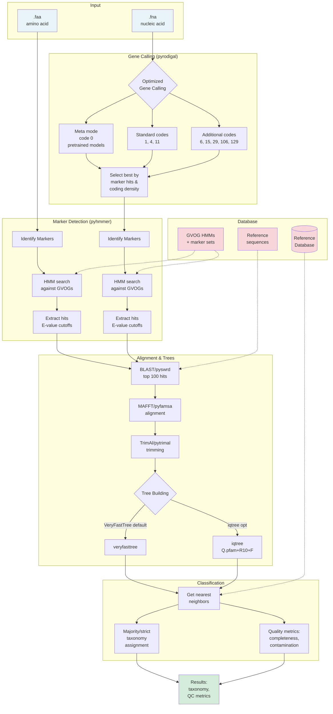

<p align="center">
  
</p>

<p align="center">
  
  
  
  
</p>

# GVClass - Giant Virus Classification Tool

GVClass assigns taxonomy to giant virus contigs and metagenome-assembled genomes (GVMAGs). It uses phylogenetic analysis based on giant virus orthologous groups (GVOGs) to provide classification from domain to family level; genus- and species-level calls are only meaningful when the query is very close to an existing reference and should be treated as "nearest-reference label" rather than an ICTV assignment.

## Quick Start

### Option 1: Pixi (Local/Development)

**Best for:** Contributing code, modifying the pipeline, or running locally

```bash
# 1. Install Pixi (one-time)
curl -fsSL https://pixi.sh/install.sh | bash

# 2. Clone repository
git clone https://github.com/NeLLi-team/gvclass.git
cd gvclass

# 3. Install dependencies (pixi handles everything)
pixi install

# 4. Download runtime resources (one-time per database location)
pixi run setup-db

# 5. Run GVClass (must run from repo directory)
pixi run gvclass <input_directory> -t 16

# Optional: install CLI wrappers into ~/bin
pixi run install-cli

# Test installation with example data
pixi run example
```

### Option 2: Apptainer/Singularity (HPC)

**Best for:** Running on HPC clusters, no installation needed

```bash
# Download the wrapper script
wget https://raw.githubusercontent.com/NeLLi-team/gvclass/main/gvclass-a
chmod +x gvclass-a

# Run from anywhere (image auto-downloads on first use)
./gvclass-a /path/to/query_genomes /path/to/results -t 32

# With options
./gvclass-a my_data my_results -t 32 --tree-method iqtree --mode-fast
```

`gvclass-a` auto-pulls `library://` images through the public Sylabs endpoint (`https://library.sylabs.io`), so users do **not** need an access token for normal pulls/runs.
The Apptainer image includes the database (~700MB) and all dependencies. No setup needed!

## Input Requirements

GVClass works best **after metagenomic binning**.

- **Recommended input**: A directory containing one or more bin files (`.fna` or `.faa`)
- **Bin definition**: One FASTA file with one or more contigs representing the same putative genome
- **Alternative mode**: Use `--contigs` to treat contigs in a multi-contig `.fna` as independent viral genomes
- **Length guidance for giant virus discovery**:
  - Minimum supported: ~20 kb
  - Better reliability: filter contigs to `>=30 kb`
  - Preferred when possible: `>=50 kb`
- **Clean filenames**: Avoid special characters (`.` `;` `:`), use `_` or `-` instead
- **Protein headers**: Format as `filename|proteinid` for best results

## Example Usage

### Using Pixi (from repo directory)

```bash
# Recommended: run on bins after metagenomic binning
pixi run gvclass my_genomes -o my_results -t 32

# With options
pixi run gvclass my_genomes -t 32 --mode-fast --tree-method iqtree -j 4

# Sensitive HMM search mode (uses E-value 1e-5 instead of GA cutoffs)
pixi run gvclass my_genomes -t 32 --sensitive

# Alternative: classify each contig in a multi-contig FNA separately
pixi run gvclass --contigs my_genome.fna -o results -t 32
```

### Species tree (opt-in supermatrix)

```bash
# Build one supermatrix species tree per query + placement taxonomy
pixi run gvclass my_genomes -o my_results -t 32 --species-tree

# Also build one combined tree over all queries at once (implies --species-tree)
pixi run gvclass my_genomes -o my_results -t 32 --species-tree-combined

# Choose the supermatrix column trimmer: witchi (default, rigorous), pytrimal (fast), none
pixi run gvclass my_genomes -o my_results -t 32 --species-tree --species-tree-trim pytrimal
```

For each genome gvclass classifies into a registered domain (NCLDV, PPV, or MIRUS),
`--species-tree` concatenates that panel's markers (the eight GVOG8 markers for NCLDV)
into a per-query supermatrix, builds that query's own species tree, and writes
`my_results/species_tree/<query>/` (`<query>.treefile`, `<query>.partitions.txt`,
`species_tree_taxonomy.tsv`) plus the `species_tree_nn_taxonomy`, `species_tree_nn_genome`,
`species_tree_nn_distance`, and `species_tree_clade_id` summary columns (the per-query
placement owns these). Adding `--species-tree-combined` additionally builds one combined
tree over all queries at once, writing `my_results/species_tree/combined.*` (or, when a
batch spans multiple domains, `my_results/species_tree/_combined/<panel>/combined.*`) as
an extra artifact (it does not change the summary columns). Neighbor breadth is adjustable
in `src/core/species_tree/config.py` — `NEIGHBORS_PER_QUERY_TREE` (default 30) and
`NEIGHBORS_PER_COMBINED_TREE` (default 20) set the top-k reference genomes kept per
marker tree. The route is fully isolated from standard per-marker classification — a
run without the flag (or a genome in no registered domain) is unchanged. Tree inference
dominates the wall clock (the per-group neighbor trees + the supermatrix tree), so the
species tree is opt-in. Tree topology, the selected reference set, and the 6-dp distances
may vary run-to-run from multi-threaded tree inference; the nearest-reference taxonomy
(the placement) is stable to this — use `--threads 1` for byte-identical results.

On `--resume`, queries skipped because they already completed keep their existing
`species_tree/<query>/` artifacts but are not re-placed (a logged warning notes this);
re-run those without `--resume` to (re)build their trees.

### Using Apptainer (gvclass-a)

```bash
# Recommended: run on bins after metagenomic binning
./gvclass-a my_genomes my_results -t 32

# Fast mode (skip order-level markers for 2-3x speedup)
./gvclass-a my_genomes my_results -t 32 --mode-fast

# Use IQ-TREE for more accurate phylogeny (slower)
./gvclass-a my_genomes my_results -t 32 --tree-method iqtree

# Sensitive HMM search mode
./gvclass-a my_genomes my_results -t 32 --sensitive

# Control parallelization (4 workers × 8 threads = 32 total)
./gvclass-a my_genomes my_results -t 32 -j 4

# Alternative: classify each contig in a multi-contig FNA separately
./gvclass-a --contigs my_genome.fna -o results -t 32
```
## Output

Results are saved to `<input_name>_results/` containing:
- `gvclass_summary.csv`, `gvclass_summary.tsv` (main table) and `gvclass_summary.extended.{tsv,csv}` (always-on per-contig contamination diagnostics)
- Optional per-query `*.contamination_candidates.tsv` files when `estimated_contamination >= 10`, the type is interpretable, and suspicious contigs are identified
- Individual query subdirectories with detailed analysis
- With `--species-tree`: a `species_tree/<query>/` directory per placed query (`<query>.treefile`, `<query>.partitions.txt`, `species_tree_taxonomy.tsv`); with `--species-tree-combined`, also `species_tree/combined.*` over all queries (`species_tree/_combined/<panel>/` for multi-domain batches)

### Output Columns Explained

The runtime implementation for completeness and contamination metrics lives in
`src/core/summarize_full.py`, `src/core/weighted_completeness.py`,
`src/core/novelty_completeness.py`, and `src/core/contamination_scoring.py`.

| Column | Description |
|--------|-------------|
| query | Input filename |
| taxonomy_majority | Full taxonomy from the per-marker single-gene tree-NN majority vote |
| species_tree_nn_taxonomy | Taxonomy of the nearest reference in the concatenated-marker species tree (a strong genome-level phylogenomic signal). `nd` unless the run used `--species-tree` (all four `species_tree_*` columns are `nd` when no species tree was built) |
| taxonomy_confidence | Confidence of the majority taxonomy: `high` (every emitted rank cleared its distinct-marker threshold) or one/more of `low_support`, `reduced_fastmode`, `no_support` |
| capsid_group | Unified capsid-type tally across the MCP panels as `label:count` (e.g. `Nucleocytoviricota:4,Gossevirus:1`); covers the Nucleocytoviricota/Mirusviricota phyla and the Bellas & Sommaruga caps groups |
| species → domain | Individual taxonomic levels with taxon counts |
| avgdist | Average tree distance to references |
| order_dup | Average copy number of expected order-level markers; elevated values suggest duplicated, chimeric, or mixed bins |
| estimated_completeness | Estimated percentage of the expected genome recovered for the assigned lineage. Determined by the novelty-aware completeness model by default |
| completeness_model_reliability | Reliability of the per-lineage completeness model (`advisory_only` / `moderate` / `high`, from its hold-out R²) — a property of the model for the assigned order, not of the genome |
| estimated_contamination | Estimated percentage of the assembly likely to represent contaminant or mixed-origin sequence. Determined by the trained `extra_trees_v1` contamination model in `resources/contamination/model.joblib` (retrained in v1.5.0 under `sensitive_mode=true` features). |
| contamination_type | High-level contamination interpretation (`clean`, `cellular`, `mixed_viral`, `phage`, `duplication`, or `uncertain`) when `estimated_contamination >= 10`. v1.5.0 adds a per-contig taxonomic-purity classifier (see `cellular_coherent_contig_count` column); bins with a novel-virus signature (no coherent cellular contigs + ≥3 viral-bearing contigs + `viral_mixture` rule-based source) are downgraded from `mixed_viral` to `uncertain` so curators can triage. |
| gvog4_completeness | GVOG4 completeness as `n/4` (distinct core NCLDV markers present) |
| gvog4_dup | GVOG4 duplication factor (total marker hits / distinct GVOG4 markers present) |
| gvog8_completeness | GVOG8 completeness as `n/8` (distinct core NCLDV markers present) |
| gvog8_dup | GVOG8 duplication factor (total marker hits / distinct GVOG8 markers present) |
| busco_completeness | Eukaryotic BUSCO single-copy completeness as `n/255`; elevated `busco_dup` indicates cellular contamination |
| busco_dup | BUSCO duplication factor (total marker hits / distinct BUSCO markers present) |
| cog_completeness | Universal COG (UNI56) single-copy completeness as `n/56`; elevated `cog_dup` indicates cellular contamination |
| cog_dup | COG (UNI56) duplication factor (total marker hits / distinct COG markers present) |
| mrya_completeness | Mryavirus completeness as `n/6` (distinct Mryavirus markers present) |
| mrya_dup | Mryavirus duplication factor (total marker hits / distinct Mryavirus markers present) |
| phage_completeness | Phage (geNomad) completeness as `n/20`; elevated `phage_dup` indicates phage contamination |
| phage_dup | Phage duplication factor (total marker hits / distinct phage markers present) |
| ncldv_mcp_total | NCLDV-specific MCP marker count |
| vp_completeness | Virophage completeness (n/4 core markers: MCP, Penton, ATPase, Protease) |
| vp_mcp | Count of proteins with VP MCP marker hits |
| plv | Count of A32-marker proteins that place with `PPV` references in the marker tree. The A32 (`PLV_PC_054`) is shared with NCLDV, so only genuine PPV placements are counted — this is 0 for ordinary NCLDV and flags Polinton-like viruses / virophages within the `PPV` (Preplasmiviricota) domain |
| mirus_completeness | Mirusviricota completeness (n/4 core markers: MCP, ATPase, Portal, Triplex) |
| contigs | Number of contigs |
| LENbp | Total length in base pairs |
| GCperc | GC content percentage |
| genecount | Number of predicted genes |
| CODINGperc | Coding density percentage |
| ttable | Genetic code used |

## Configuration (Optional)

Create `gvclass_config.yaml` to set defaults:

```yaml
database:
  path: resources                    # Relative path: <gvclass_repo>/resources
  # path: /media/shared-expansion/dbs/gvclass_resources  # Absolute path on shared storage
  download_url: https://zenodo.org/records/20479524/files/resources_v1_6_0.tar.gz?download=1
  download_version: v1.6.0
  download_sha256: f744f7144ea69d6c3ccffe56e7721d6fd598685853005e0fb90d04e699d9b23f

pipeline:
  tree_method: veryfasttree         # VeryFastTree (default, fast); or 'iqtree' (Q.pfam+R10+F --fast; slower, more accurate)
  iqtree_mode: fast                 # species-tree IQ-TREE search: 'fast' (--fast) or 'ufboot' (ultrafast bootstrap, slower, writes .contree)
  mode_fast: false                  # Skip order-level marker trees when true (speeds up analysis)
  completeness_mode: novelty-aware  # or 'legacy' to surface the old estimate
  sensitive_mode: true              # Default: use E-value 1e-5 for pyhmmer instead of GA cutoffs
  contigs_min_length: 10000         # In --contigs mode, skip contigs shorter than this (bp)
  threads: 16                       # Default thread count
```

Sensitive HMM filtering is enabled by default as of `v1.4.1`. Set
`sensitive_mode: false` in your config if you need the legacy GA-based
filtering behavior for a specific run.

### Contamination model

As of `v1.5.0`, the contamination model
(`resources/contamination/model.joblib`, `ExtraTreesRegressor`) ships in the
runtime resources bundle and is retrained on features generated with
`sensitive_mode=true` (the shipped default since `v1.4.1`). Training and
inference now see the same feature distribution, so the contamination estimate
is applied under either sensitive or non-sensitive runs without a protective
short-circuit.

Held-out performance on the real-contig benchmark: MAE 3.92% across the
test set; mean predicted contamination on clean bins 0.14%.

A note on "contamination" in the giant virus context: giant viruses
naturally carry hundreds of eukaryote-like genes acquired through
horizontal gene transfer, and those genes are **not** counted as
contamination by the pipeline. The cellular-marker signal is limited
to conserved translation-machinery HMMs (BUSCO eukaryotic set + UNI56
prokaryotic set) that giant viruses obligately lack. The `mixed_viral`
category reflects multi-viral-order mixing on the same bin (e.g. both
Pimascovirales and Imitervirales proteins present), not host HGT
content.

Database path precedence:
- `--database` CLI flag
- `GVCLASS_DB` environment variable
- `database.path` in config
- default `resources` in the GVClass repo

Examples:
```bash
# Use shared database location for all runs
export GVCLASS_DB=/media/shared-expansion/dbs/gvclass_resources
pixi run setup-db
pixi run gvclass example -o example_results
```

When the configured database source is a Zenodo record, GVClass now prints the installed
database version, checks Zenodo for the latest published version, and offers to update with
`yes` as the default response in interactive sessions.

## Releases

Release notes are maintained on the
[GitHub Releases page](https://github.com/NeLLi-team/gvclass/releases).
The latest software release is `v1.6.1`; the compatible database/runtime
resource bundle is `v1.6.0` (Zenodo DOI
`10.5281/zenodo.20479524`). This release fixes lineage-constrained taxonomy
consensus and uses the harmonized database labels by default.

## Advanced Usage

### Advanced Container Usage

The `gvclass-a` wrapper handles container execution automatically. For manual control:

```bash
# Pull the image manually (works without auth token for public images)
apptainer pull --library https://library.sylabs.io \
  gvclass_1.6.1.sif library://nelligroup-jgi/gvclass/gvclass:1.6.1

# Run with manual bind mounts
apptainer run -B /path/to/data:/input -B /path/to/results:/output \
  gvclass_1.6.1.sif /input -o /output -t 32
```

The wrapper is simpler and handles bind mounts automatically.

### Contamination Model Requirement

Primary contamination estimates are produced by a trained model bundle in `resources/contamination/model.joblib`.
The rule-based score remains in the output as a diagnostic/model feature, but it is no longer the production estimate surfaced as `estimated_contamination`.
If the trained bundle is missing, GVClass should be treated as not fully configured for contamination estimation.

#### Publishing the Apptainer Image (library://)

To make `apptainer pull --library https://library.sylabs.io ...` work for users, you must build and push the SIF to the Sylabs library:

```bash
# Build the SIF from the definition file
apptainer build gvclass.sif containers/apptainer/gvclass.def

# Authenticate to the Sylabs library (one-time)
apptainer remote login

# Push the image to the library
apptainer push gvclass.sif library://nelligroup-jgi/gvclass/gvclass:1.6.1
```

### Full CLI Reference (gvclass)

| Option | Short | Description | Default |
|--------|-------|-------------|---------|
| `query_dir` | | Input directory or file | Required |
| `--output-dir` | `-o` | Output directory | `<query>_results` |
| `--threads` | `-t` | Total threads | 16 |
| `--max-workers` | `-j` | Parallel workers | Auto |
| `--threads-per-worker` | | Threads per worker | Auto |
| `--database` | `-d` | Override database path | `GVCLASS_DB` → config → `<repo>/resources` |
| `--tree-method` | | `veryfasttree` or `iqtree` | veryfasttree |
| `--iqtree-mode` | | `fast` or `ufboot` (species-tree IQ-TREE search) | fast |
| `--mode-fast` | `-f` | Fast mode: core markers only | True |
| `--extended` | `-e` | Extended mode: all marker trees | False |
| `--completeness-mode` | | `legacy` or `novelty-aware` for `estimated_completeness` | novelty-aware |
| `--sensitive` | | Sensitive HMM mode (`E=1e-5`, `domE=1e-5`, skip GA cutoffs) | False |
| `--contigs` | `-C` | Treat each contig as an independent query genome | False |
| `--resume` | | Resume interrupted run | False |
| `--verbose` | `-v` | Enable debug output | False |
| `--version` | | Show version info | |
| `--cluster-type` | | `local`, `slurm`, `pbs`, `sge` | local |
| `--cluster-queue` | | HPC queue/partition name | |
| `--cluster-project` | | HPC project/account | |
| `--cluster-walltime` | | HPC time limit | 04:00:00 |

### Contig Splitting Mode (`--contigs` / `-C`)

By default, GVClass expects bins (directory input). Use `--contigs` when you want to process contigs as separate query genomes.

Primary use case:

```bash
# Split contigs and classify each independently
gvclass --contigs metagenome_contigs.fna -o results -t 32
```

**How it works:**
1. Accepts a **single multi-contig FNA file** (primary use case; directory input is also supported)
2. Splits each sequence into individual contig files in a temporary directory
3. Sanitizes contig IDs for filenames (replaces `/\:*?"<>|` and spaces with `_`)
4. Applies minimum length filter from config (`pipeline.contigs_min_length`, default: `10000` bp)
5. Processes each retained contig independently through the full pipeline
6. Combines results into `gvclass_summary.tsv`
7. Cleans up temporary files automatically

**Use cases:**
- Screening metagenome contigs before binning
- Evaluating candidate viral contigs as independent genomes
- Rapid triage when bins are not yet available

For giant virus-focused analyses, set `pipeline.contigs_min_length` to at least `30000` (preferably `50000`) for more reliable classifications.

### Genetic Code Selection

GVClass tests **9 genetic codes** to find optimal gene predictions:

- **Code 0**: Meta mode using pretrained models (pyrodigal metagenomic mode)
- **Codes 1, 4, 11**: Standard translation tables
- **Codes 6, 15, 29, 106, 129**: Additional translation tables

**Selection logic:**
1. Start with meta mode (code 0) as baseline
2. Override if another code has:
   - More complete marker hits (>66% HMM coverage), OR
   - Same hits but >5% better average hit score, OR
   - Same hits but >5% better coding density

The selected code is reported in the `ttable` output column.

### Sensitive HMM Mode (`--sensitive`)

Use sensitive mode when you want a more permissive marker search:

- Forces pyhmmer to use `E=1e-5` and `domE=1e-5`
- Disables GA/TC/NC model cutoff filtering (`--cut_ga`-style behavior)
- Can recover weaker hits, but may increase false positives

## Interpreting Quality Metrics

### Genome completeness
- `estimated_completeness` is the only completeness field exposed in the final summary table. By default it uses the tuned novelty-aware path; `--completeness-mode legacy` can still switch the underlying estimator for advanced users.
- The legacy, weighted, and novelty-aware intermediate completeness metrics remain available in the codebase and developer docs, but they are intentionally omitted from the main summary table.

### Contamination and mixed populations
- `estimated_contamination` is the only contamination estimate exposed in the final summary table. It is the trained model output and should be treated as the primary contamination estimate.
- `contamination_type` is the high-level interpretation of the likely contamination source when `estimated_contamination >= 10`.
- Detailed per-contig taxonomic-purity / contamination diagnostics (`cellular_coherent_*`, `cellular_lineage_purity_median`, `cellular_hit_identity_median`, `viral_bearing_contig_count`, `contig_attribution_mode`) are written to the supplementary `gvclass_summary.extended.tsv`, keeping the main summary table readable.
- `order_dup` and `gvog8_dup` summarize marker duplication. Values above ~2 suggest multiple populations or assembly chimeras; below ~1.5 is typically clean.
- `gvog8_completeness` and `gvog8_dup` help distinguish true gene expansions (more distinct markers, moderate duplication) from assembly artefacts (high duplication, few distinct markers).
- `ncldv_mcp_total` and `mrya_completeness` provide additional lineage-specific marker hints.
- `vp_completeness` and `mirus_completeness` show core marker coverage (n/4) for virophages and Mirusviricota respectively.
- Polinton-like viruses and virophages are reported together under the unified `PPV` (Preplasmiviricota) domain; the `plv` count helps tell Polinton-like viruses apart from virophages within it (both carry VP MCP markers, but Polinton-like viruses also hit a PLV-specific marker; the count is not binary).

### Cellular carry-over
- `order_dup` and `gvog8_dup` are retained in the final summary table as duplication-style QC indicators; the `busco_completeness`/`cog_completeness` panels (and their `_dup` factors) flag cellular single-copy-marker carry-over.

Use these fields together: a high completeness score with low duplication and `contamination_type = clean` is characteristic of a high-quality GVMAG; any combination of low completeness plus high duplication or a non-clean contamination type warrants manual curation.

## Performance Optimization

### Speed Up Analysis

1. **Enable Fast Mode** - Skip order-level marker trees (OG markers):
   ```bash
   # Command line option
   pixi run gvclass <input_directory> --mode-fast
   
   # Or in config file
   pipeline:
     mode_fast: true  # Skips ~100 order-specific markers, 2-3x faster
   ```

2. **Use IQ-TREE for higher accuracy (slower)**:
   ```bash
   # Default: VeryFastTree (fast)
   pixi run gvclass <input_directory> --tree-method veryfasttree

   # IQ-TREE (--fast, Q.pfam+R10+F; more accurate, much slower)
   pixi run gvclass <input_directory> --tree-method iqtree
   ```

3. **Optimize Thread Usage**:
   ```bash
   # Use all available cores
   pixi run gvclass <input_directory> -t 32

   # Control parallelization: 4 parallel workers, 8 threads each (= 32 total)
   pixi run gvclass <input_directory> -t 32 -j 4
   ```

### IQ-TREE Specific Options

VeryFastTree is the default. When IQ-TREE is selected (`--tree-method iqtree`), the pipeline uses:
- Model: `Q.pfam+R10+F` (Pfam exchange matrix + 10-category FreeRate + empirical frequencies)
- Search mode (`--iqtree-mode` / config `iqtree_mode`):
  - `fast` (default): `--fast` search (FastTree-like), no bootstrap.
  - `ufboot`: ultrafast bootstrap (`-B 1000 -bnni`); adds branch-support values and
    writes a `.contree` consensus tree. **Much slower** — use it for a final,
    well-supported phylogeny, not routine runs.
- **Scope**: `iqtree_mode` applies to the **species tree** (`--species-tree`). The
  per-marker gene trees always use `--fast` — they are internal nearest-neighbor
  scaffolds where bootstrap adds cost but no value.

To modify IQ-TREE behavior, edit `src/core/alignment.py` (`IQTREE_MODEL`,
`iqtree_search_args`) and `src/core/marker_processing.py` (per-marker invocation).

### Understanding Markers

- **Core markers**: Always processed (GVOG4, GVOG8, MCP, etc.)
- **Order-level markers**: 576 OG markers conserved in different viral orders
  - Processed when `mode_fast: false` (default)
  - Skipped when `mode_fast: true` (faster but less precise order assignment)

## Making GVClass Available Globally

Both wrappers can be made globally accessible:

### Option 1: Apptainer (gvclass-a) - Recommended for HPC

```bash
# Copy gvclass-a to your personal bin
mkdir -p "$HOME/bin"
cp gvclass-a "$HOME/bin/"
chmod +x "$HOME/bin/gvclass-a"

# Add to PATH (if not already)
echo 'export PATH="$HOME/bin:$PATH"' >> "$HOME/.bashrc"
source "$HOME/.bashrc"

# Now use from anywhere!
gvclass-a /data/genomes /data/results -t 32
```

### Option 2: Symlink gvclass (for Pixi users)

```bash
# From the gvclass repo directory
cd /path/to/gvclass  # Navigate to your cloned repo first

# Create symlink (REQUIRED - copying won't work!)
mkdir -p "$HOME/bin"
ln -s "$(pwd)/gvclass" "$HOME/bin/gvclass"

# Add to PATH (if not already)
echo 'export PATH="$HOME/bin:$PATH"' >> "$HOME/.bashrc"
source "$HOME/.bashrc"

# Now run from anywhere - symlink allows script to find its repo
cd /anywhere
gvclass my_data -o results -t 32
```

## How It Works


```mermaid
flowchart TD
    subgraph Input
        FNA[".fna<br/>nucleic acid"]
        FAA[".faa<br/>amino acid"]
    end
    
    subgraph Database
        DB[(Reference<br/>Database)]
        MODELS[GVOG HMMs<br/>+ marker sets]
        REF[Reference<br/>sequences]
    end
    
    FNA --> OPGC{Optimized<br/>Gene Calling}
    FAA --> ID1[Identify Markers]
    
    subgraph "Gene Calling (pyrodigal)"
        OPGC --> META[Meta mode<br/>code 0<br/>pretrained models]
        OPGC --> STD[Standard codes<br/>1, 4, 11]
        OPGC --> ADD[Additional codes<br/>6, 15, 29, 106, 129]
        META --> RANK[Select best by<br/>marker hits &<br/>coding density]
        STD --> RANK
        ADD --> RANK
    end
    
    RANK --> ID2[Identify Markers]
    
    subgraph "Marker Detection (pyhmmer)"
        ID1 --> HMM1[HMM search<br/>against GVOGs]
        ID2 --> HMM2[HMM search<br/>against GVOGs]
        HMM1 --> HITS1[Extract hits<br/>E-value cutoffs]
        HMM2 --> HITS2[Extract hits<br/>E-value cutoffs]
    end
    
    HITS1 --> BLAST[BLAST/pyswrd<br/>top 100 hits]
    HITS2 --> BLAST
    
    subgraph "Alignment & Trees"
        BLAST --> ALIGN[MAFFT/pyfamsa<br/>alignment]
        ALIGN --> TRIM[TrimAl/pytrimal<br/>trimming]
        TRIM --> TREE{Tree Building}
        TREE -->|VeryFastTree default| FT[veryfasttree]
        TREE -->|iqtree opt| IQ[iqtree<br/>Q.pfam+R10+F]
    end
    
    FT --> NN[Get nearest<br/>neighbors]
    IQ --> NN
    
    subgraph "Classification"
        NN --> TAX[Majority/strict<br/>taxonomy<br/>assignment]
        NN --> QC[Quality metrics:<br/>completeness,<br/>contamination]
    end
    
    TAX --> OUT[Results:<br/>taxonomy,<br/>QC metrics]
    QC --> OUT
    
    MODELS -.-> HMM1
    MODELS -.-> HMM2
    REF -.-> BLAST
    DB -.-> NN
    
    style FNA fill:#e8f4f8
    style FAA fill:#e8f4f8
    style OUT fill:#d4edda
    style DB fill:#f8d7da
    style MODELS fill:#f8d7da
    style REF fill:#f8d7da
```

## Citation

If you use GVClass, please cite:

> Pitot et al. (2024): Conservative taxonomy and quality assessment of giant virus genomes with GVClass. npj Viruses. https://www.nature.com/articles/s44298-024-00069-7

## Database References

The GVClass runtime resources include genomes/models derived from the following sources:

> Medvedeva S, Guyet U, Pelletier E, et al. (2026): Widespread and intron-rich mirusviruses are predicted to reproduce in nuclei of unicellular eukaryotes. Nature Microbiology 11:228-239. https://doi.org/10.1038/s41564-025-01906-2

> Roux S, Fischer MG, Hackl T, Katz LA, Schulz F, Yutin N (2023): Updated Virophage Taxonomy and Distinction from Polinton-like Viruses. Biomolecules 13(2):204. https://doi.org/10.3390/biom13020204

> Fiamenghi MB, Camargo AP, Chasapi IN, et al. (2025): Meta-virus resource (MetaVR): expanding the frontiers of viral diversity with 24 million uncultivated virus genomes. Nucleic Acids Research gkaf1283. https://doi.org/10.1093/nar/gkaf1283

> Vasquez YM, Nardi T, Terasaki GM, et al. (2025): Genome-resolved expansion of Nucleocytoviricota and Mirusviricota reveals new diversity, functional potential, and biotechnological applications. bioRxiv 2025.09.26.678796. https://doi.org/10.1101/2025.09.26.678796

> Bellas CM, Sommaruga R (2021): Polinton-like viruses are abundant in aquatic ecosystems. Microbiome 9:13. https://doi.org/10.1186/s40168-020-00956-0

## Support

- **Issues**: [GitHub Issues](https://github.com/NeLLi-team/gvclass/issues)
- **Contact**: fschulz@lbl.gov

## License

BSD 3-Clause License - see LICENSE file for details

---
<sub>Version 1.6.1 - May 2026</sub>
