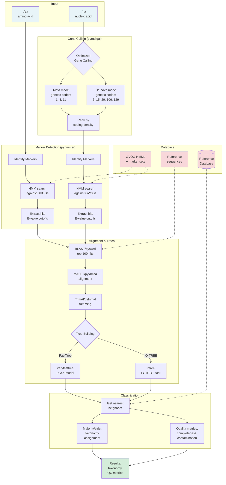

<p align="center">
  
</p>

<p align="center">
  
  
  
  
</p>

# GVClass - Giant Virus Classification Tool

GVClass assigns taxonomy to giant virus contigs and metagenome-assembled genomes (GVMAGs). It uses phylogenetic analysis based on giant virus orthologous groups (GVOGs) to provide accurate classification from domain to species level.

## 🚀 Quick Start

### Option 1: Apptainer/Singularity (Recommended for HPC)

**Best for:** Running on HPC clusters, no installation needed

```bash
# Download the wrapper script
wget https://raw.githubusercontent.com/NeLLi-team/gvclass/main/gvclass-a
chmod +x gvclass-a

# Run from anywhere (image auto-downloads on first use)
./gvclass-a /path/to/query_genomes /path/to/results -t 32

# With options
./gvclass-a my_data my_results -t 32 --tree-method iqtree --mode-fast
```

The Apptainer image includes the database (~700MB) and all dependencies. No setup needed!

### Option 2: Pixi (For Development/Local Use)

**Best for:** Contributing code, modifying the pipeline, or running locally

```bash
# 1. Install Pixi (one-time)
curl -fsSL https://pixi.sh/install.sh | bash

# 2. Clone repository
git clone https://github.com/NeLLi-team/gvclass.git
cd gvclass

# 3. Install dependencies (pixi handles everything)
pixi install

# 4. Run GVClass (must run from repo directory)
pixi run gvclass <input_directory> -t 16

# Test installation with example data
pixi run run-example
```

## 📋 Input Requirements

- **Directory** containing `.fna` (nucleic acid) or `.faa` (protein) files
- **Minimum size**: 20kb recommended (50kb+ preferred)
- **Clean filenames**: Avoid special characters (`.` `;` `:`), use `_` or `-` instead
- **Protein headers**: Format as `filename|proteinid` for best results

## 🎯 Example Usage

### Using Apptainer (gvclass-a)

```bash
# Basic usage
./gvclass-a my_genomes my_results -t 32

# Fast mode (skip order-level markers for 2-3x speedup)
./gvclass-a my_genomes my_results -t 32 --mode-fast

# Use IQ-TREE for more accurate phylogeny (slower)
./gvclass-a my_genomes my_results -t 32 --tree-method iqtree

# Control parallelization (4 workers × 8 threads = 32 total)
./gvclass-a my_genomes my_results -t 32 -j 4
```

### Using Pixi (from repo directory)

```bash
# Basic usage
pixi run gvclass my_genomes -o my_results -t 32

# With options
pixi run gvclass my_genomes -t 32 --mode-fast --tree-method iqtree -j 4
```

## 📊 Output

Results are saved to `<input_name>_results/` containing:
- `gvclass_summary.tsv` - Main results with taxonomy assignments (legacy format)
- `gvclass_summary.csv` - Main results with taxonomy assignments (CSV for spreadsheets)
- Individual query subdirectories with detailed analysis

### Output Columns Explained

| Column | Description |
|--------|-------------|
| query | Input filename |
| taxonomy_majority | Full taxonomy based on majority rule |
| taxonomy_strict | Conservative taxonomy (100% agreement) |
| species → domain | Individual taxonomic levels with taxon counts |
| avgdist | Average tree distance to references |
| order_dup | Duplication factor indicating contamination level |
| order_completeness | Order-specific completeness (% unique markers found) |
| gvog4_unique | Count of unique GVOG4 markers found |
| gvog8_unique/total/dup | GVOG8 marker counts and duplication |
| mcp_total | Major capsid protein marker count |
| mirus_unique/total/dup | Mimiviridae-specific marker counts |
| mrya_unique/total | Marseilleviridae-specific marker counts |
| phage_unique/total | Phage marker counts |
| cellular_unique/total/dup | Cellular contamination markers |
| contigs | Number of contigs |
| LENbp | Total length in base pairs |
| GCperc | GC content percentage |
| genecount | Number of predicted genes |
| CODINGperc | Coding density percentage |
| ttable | Genetic code used |
| weighted_order_completeness | **NEW**: Weighted completeness score considering marker importance |

## ⚙️ Configuration (Optional)

Create `gvclass_config.yaml` to set defaults:

```yaml
database:
  path: resources                    # Database location

pipeline:
  tree_method: fasttree             # or 'iqtree' for more accuracy
  mode_fast: false                  # Skip order-level marker trees when true (speeds up analysis)
  threads: 16                       # Default thread count
```

## 🆕 What's New in v1.1.1

- **🚀 Modern Architecture**: Prefect workflow orchestration with ThreadPoolExecutor parallelization
- **🧬 Taxonomy Refresh**: Reference database v1.1.1 with corrected eukaryotic strings and updated giant virus taxonomy ([preprint](https://doi.org/10.1101/2025.09.26.678796))
- **📦 Easy Installation**: Pixi package manager (2-3x faster)
- **🐍 Pure Python**: All tools replaced with faster Python versions
- **⚡ Better Performance**: Parallel query processing, 25% faster
- **🔄 Automatic Recovery**: Task caching and retry on failures
- **✅ Auto Database Setup**: No manual download needed

## 📖 Advanced Usage

### Advanced Container Usage

The `gvclass-a` wrapper (recommended above) handles container execution automatically. For manual control:

```bash
# Pull the image manually
apptainer pull library://nelligroup-jgi/gvclass/gvclass:1.1.1

# Run with manual bind mounts
apptainer run -B /path/to/data:/input -B /path/to/results:/output \
  gvclass_1.1.1.sif /input -o /output -t 32
```

The wrapper is simpler and handles bind mounts automatically.

## Interpreting Quality Metrics

### Genome completeness
- `order_completeness` shows the percentage of order-specific markers detected in single copy. Values above ~70% generally indicate near-complete genomes, 30–70% partial, and below 30% highly fragmented assemblies.
- `weighted_order_completeness` applies conservation-based weights; large gaps here usually point to missing hallmark genes even if raw counts look acceptable.

### Contamination and mixed populations
- `order_dup` and `gvog8_dup` summarize marker duplication. Values above ~2 suggest multiple populations or assembly chimeras; below ~1.5 is typically clean.
- `gvog8_total` and `gvog8_unique` help distinguish true gene expansions (high total, moderate duplication) from assembly artefacts (high duplication, low uniqueness).
- `mcp_total`, `mirus_total`, `mrya_total` provide additional lineage-specific duplication hints for Marseilleviridae, Mirusviruses, and related groups.

### Cellular carry-over
- `uni56_total` (UNI56) counts universal cellular markers; more than ~10 unique hits point to host contamination or bins that include cellular contigs.
- The wrapper also reports `busco_*` fields when available; elevated counts complement UNI56 for spotting non-viral material.

Use these fields together: a high completeness score with low duplication and low UNI56 is characteristic of a high-quality GVMAG; any combination of low completeness plus high duplication or high UNI56 warrants manual curation.

## ⚡ Performance Optimization

### Speed Up Analysis

1. **Enable Fast Mode** - Skip order-level marker trees (OG markers):
   ```bash
   # Command line option
   pixi run gvclass <input_directory> --mode-fast
   
   # Or in config file
   pipeline:
     mode_fast: true  # Skips ~100 order-specific markers, 2-3x faster
   ```

2. **Use FastTree Instead of IQ-TREE**:
   ```bash
   # Default (faster)
   pixi run gvclass <input_directory> --tree-method fasttree
   
   # IQ-TREE (more accurate but slower)
   pixi run gvclass <input_directory> --tree-method iqtree
   ```

3. **Optimize Thread Usage**:
   ```bash
   # Use all available cores
   pixi run gvclass <input_directory> -t 32

   # Control parallelization: 4 parallel workers, 8 threads each (= 32 total)
   pixi run gvclass <input_directory> -t 32 -j 4
   ```

### IQ-TREE Specific Options

When using IQ-TREE (`--tree-method iqtree`), the pipeline automatically uses:
- Model: `LG+F+G` (fast protein model)
- `-fast` flag for faster tree search
- Single thread per marker (parallelization happens at marker level)

To modify IQ-TREE behavior, edit `src/core/marker_processing.py`.

### Understanding Markers

- **Core markers**: Always processed (GVOG4, GVOG8, MCP, etc.)
- **Order-level markers**: 576 OG markers conserved in different viral orders
  - Processed when `mode_fast: false` (default)
  - Skipped when `mode_fast: true` (faster but less precise order assignment)

## 🔧 Making GVClass Available Globally

Both wrappers can be made globally accessible:

### Option 1: Apptainer (gvclass-a) - Recommended for HPC

```bash
# Copy gvclass-a to your personal bin
mkdir -p "$HOME/bin"
cp gvclass-a "$HOME/bin/"
chmod +x "$HOME/bin/gvclass-a"

# Add to PATH (if not already)
echo 'export PATH="$HOME/bin:$PATH"' >> "$HOME/.bashrc"
source "$HOME/.bashrc"

# Now use from anywhere!
gvclass-a /data/genomes /data/results -t 32
```

### Option 2: Symlink gvclass (for Pixi users)

```bash
# From the gvclass repo directory
cd /path/to/gvclass  # Navigate to your cloned repo first

# Create symlink (REQUIRED - copying won't work!)
mkdir -p "$HOME/bin"
ln -s "$(pwd)/gvclass" "$HOME/bin/gvclass"

# Add to PATH (if not already)
echo 'export PATH="$HOME/bin:$PATH"' >> "$HOME/.bashrc"
source "$HOME/.bashrc"

# Now run from anywhere - symlink allows script to find its repo
cd /anywhere
gvclass my_data -o results -t 32
```

## 🔬 How It Works



## 📝 Citation

If you use GVClass, please cite:

> Pitot et al. (2024): Conservative taxonomy and quality assessment of giant virus genomes with GVClass. npj Viruses. https://www.nature.com/articles/s44298-024-00069-7

## 🤝 Support

- **Issues**: [GitHub Issues](https://github.com/NeLLi-team/gvclass/issues)
- **Contact**: fschulz@lbl.gov

## 📄 License

BSD 3-Clause License - see LICENSE file for details

---
<sub>Version 1.1.1 - October 2025</sub>
