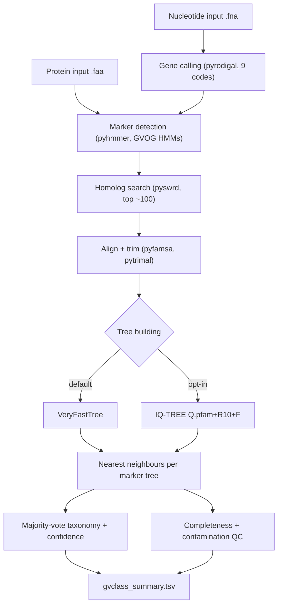

# How GVClass works

Giant virus genomes arrive in pieces. A metagenome yields contigs and bins, rarely a closed genome, and the proteins on those fragments often have no close relative in any database. A single best BLAST hit against such sparse, fast-evolving sequences is easy to get wrong: the top match can sit in a different family, or in a cellular genome that once swapped a gene with a virus. GVClass takes a slower route. For each conserved ortholog it finds on a query, it builds a phylogenetic tree that places the query protein among curated reference sequences, then reads taxonomy from where the query lands. Placement in a tree of giant virus orthologous groups (GVOGs) is harder to fool than a similarity score, and it carries its own evidence: branch length, neighbours, and agreement across many markers.

Here is the path a query takes, from an input file to the final table.

The pipeline runs as six stages. Each stage feeds the next, and most of the wall-clock time goes into the trees.

## Gene calling across nine genetic codes

Nucleotide input (`.fna`) begins with gene prediction, because the correct reading frame is not known in advance and giant viruses use several genetic codes. GVClass calls genes with pyrodigal (a git fork that adds translation tables 106 and 129) and tests nine codes: 0, 1, 4, 6, 11, 15, 29, 106, and 129. Code 0 is pyrodigal's metagenomic meta mode, which scores a query against pretrained models and serves as the baseline. Another code replaces that baseline only when it earns the swap: more complete marker hits (above 66% HMM coverage), or the same number of hits with at least 5% better average hit score, or the same hits with at least 5% better coding density (the `improvement_threshold` is 0.05). The winning code is reported in the `ttable` column. Protein input (`.faa`) skips this stage, since the genes are already called, and reports `ttable=no_fna`.

## Marker detection

With proteins in hand, GVClass searches them for conserved markers using pyhmmer 0.12.0 against the GVOG and marker HMM sets. The default is sensitive mode, which accepts hits at `E=1e-5` and `domE=1e-5` and skips the curated GA model cutoffs; turning sensitive mode off restores GA-based filtering. The markers span several panels: GVOG4 and GVOG8 (the 4 and 8 core single-copy NCLDV orthologs), BUSCO (255 eukaryotic single-copy genes) and UNI56 (56 universal prokaryotic genes) as cellular carry-over flags, smaller panels for Mryavirus (6), phage detection (the 20-marker geNomad set), the virophage core (4), and the Mirusviricota core (4), plus major-capsid-protein markers for capsid typing. An order-level panel of 576 order-conserved markers is searched only when fast mode is off. See [the marker reference](../reference/markers.md) for the full panel list.

!!! note

    Fast mode is on by default (`mode_fast: true`), so the 576 order-level marker trees are skipped unless you pass `-e/--extended`. Skipping them buys a 2 to 3x speedup at coarser order resolution. The [CLI reference](../reference/cli.md) lists the flags that change tree method, search sensitivity, and parallelism.

## Homolog search

For every marker a query carries, GVClass pulls candidate reference sequences with pyswrd 0.3.1, a fast BLAST-like search, and keeps roughly the top 100 hits per marker. This narrows each marker's reference set to a tractable, relevant slice before the costly alignment and tree steps.

## Alignment, trimming, and tree building

Each marker's query-plus-reference set is aligned with pyfamsa 0.5.3 and trimmed with pytrimal 0.8.5 to drop poorly aligned columns. GVClass then infers one tree per marker. The default builder is VeryFastTree 4.0.4.1, fast enough to run a tree for every marker on every query. On request (`--tree-method iqtree`) it switches to IQ-TREE 3.1.2 under the `Q.pfam+R10+F` model, which is slower and more thorough. Per-marker gene trees always run in `--fast` mode, where they act as nearest-neighbour scaffolds rather than publication phylogenies. The [tune speed and accuracy](../how-to/tune-speed-and-accuracy.md) guide covers when each builder pays off.

## Nearest neighbours and the majority vote

From each marker tree, GVClass reads the nearest reference neighbour of the query and the distance to it. One marker casts one vote: the taxonomy of its closest reference. Across all of a query's markers, GVClass takes a majority vote at each rank, writing the result to `taxonomy_majority` together with per-rank taxon counts and an average distance. A `taxonomy_confidence` flag records how well the vote held: `high` when every emitted rank cleared its distinct-marker threshold, or one or more of `low_support`, `reduced_fastmode`, and `no_support` when it did not. This per-marker majority is the default route; an opt-in concatenated-marker [species tree](../explanation/species-tree.md) (`--species-tree`) adds a genome-level placement on top.

The same per-marker evidence drives quality control. Completeness comes from a novelty-aware model that estimates the fraction of the expected genome recovered for the assigned lineage, and contamination from a trained model (`extra_trees_v1`). Notably, the eukaryote-like genes giant viruses acquire by horizontal transfer are not scored as contamination; the cellular signal is restricted to the BUSCO and UNI56 translation-machinery markers that giant viruses obligately lack. All of it lands in `gvclass_summary.tsv`. The [taxonomy](../explanation/taxonomy.md) and [quality metrics](../explanation/quality-metrics.md) pages explain how to read these fields, and [the output reference](../reference/output.md) documents every column.

## Why GVClass is conservative

The choice that shapes every result is placement before voting. Together, per-marker phylogenetic placement and a majority vote across markers make the pipeline conservative by construction: a rank is emitted only when independent marker trees agree on it. That agreement is easy to reach at the level of domain and family, where GVOGs are deeply conserved and reference sampling is dense. It thins out toward genus and species, where a query is often the first of its kind and a single nearby reference can dominate. Consistent with this, GVClass treats its domain-to-family calls as reliable taxonomy and reads its genus and species fields as a nearest-reference label, not a formal ICTV assignment.
