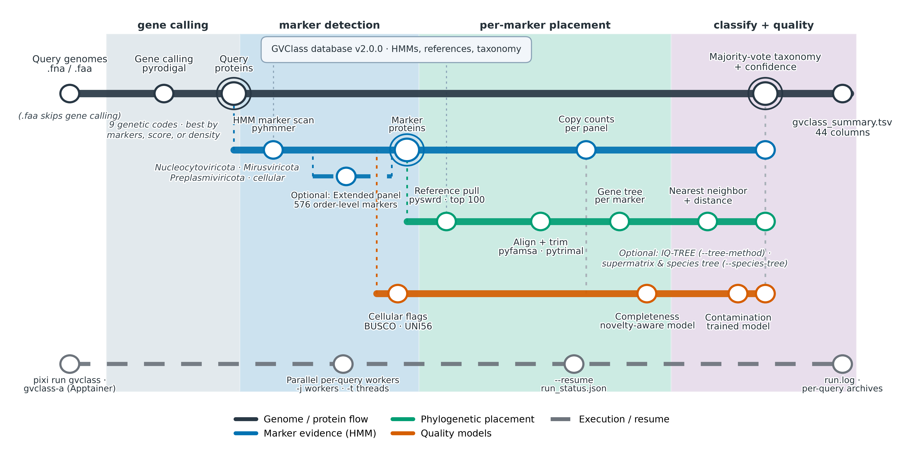

# How GVClass works

GVClass classifies contigs and genome bins from the placement of conserved proteins in reference gene trees. Each marker contributes one vote to the taxonomic assignment. The main results are written to `gvclass_summary.tsv`.

## Gene prediction

For nucleotide input (`.fna`), GVClass uses pyrodigal to test codes 0, 1, 4, 6, 11, 15, 29, 106, and 129. Code 0 denotes metagenomic gene prediction with pretrained models.

Codes are ranked by complete marker hits, average best-hit score, coding density, and code preference. A top-ranked nonzero code replaces code 0 only if it has at least two more complete hits, a 10% higher average best-hit score, or a 5% higher coding density. The selected code is reported in `ttable`; metagenomic mode is reported as `codemeta`.

Protein input (`.faa`) skips gene prediction and reports `ttable=no_fna`.

## Marker detection and gene trees

PyHMMER searches the predicted or supplied proteins against viral and cellular marker HMMs. Sensitive mode is the default, with sequence and domain E-value thresholds of `1e-5`. Disabling sensitive mode uses curated gathering thresholds where available.

For each detected marker group, GVClass selects reference proteins with pyswrd, aligns them with the query proteins using pyfamsa, and trims the alignment with pytrimal. VeryFastTree builds the gene tree by default. `--tree-method iqtree` uses IQ-TREE with the `Q.pfam+R10+F` model and a `--fast` search for these marker trees.

Fast mode skips order-level marker trees but still searches their HMMs. `--extended` includes those trees. See [marker panels](../reference/markers.md) and [tree settings](../how-to/tune-speed-and-accuracy.md).

## Classification and quality estimates

GVClass assigns each query protein the taxonomy of its nearest reference in a marker tree. Marker votes are combined from domain to species, with lower ranks restricted to the selected parent lineage. Assignments without enough distinct markers are withheld. [Taxonomy and classification](taxonomy.md) describes the support thresholds and confidence flags.

Marker recovery, duplication, reference matches, and contig-level evidence contribute to the [completeness and contamination estimates](quality-metrics.md). Interpret these with the taxonomic assignment and model reliability.

The optional [species-tree analysis](species-tree.md) concatenates a viral marker panel to place each genome among references. `--species-tree-combined` also places eligible queries together in one tree per viral panel.

Start with the [example tutorial](../tutorials/getting-started.md), or follow [Build a species tree](../how-to/build-a-species-tree.md).
