# GVClass Workflow Diagram

## Pipeline Overview

## Parallel Processing

## Key Decision Points

1. **File Type Detection**
   - `.fna` → Gene calling required
   - `.faa` → Direct to HMM search

2. **Genetic Code Selection**
   - Tests codes: 0, 1, 4, 6, 11, 15, 29
   - Selects code with >2% better coding density than code 0

3. **Marker Filtering**
   - Must pass E-value threshold
   - Must have ≥66% HMM coverage
   - Must have ≥3 sequences for alignment

4. **Tree Method Selection**
   - FastTree: Default, faster
   - IQ-TREE: More accurate, slower

5. **Taxonomy Assignment**
   - Requires consensus among all nearest neighbors
   - Falls back to higher taxonomic levels if no consensus

## Performance Bottlenecks

```mermaid
graph TD
    A[Gene Calling<br/>🐌 Serial] -->|Bottleneck| B[Can parallelize<br/>genetic codes]
    
    C[BLAST Search<br/>🐌 pyswrd slow] -->|Bottleneck| D[Replace with<br/>Diamond/MMseqs2]
    
    E[Tree Building<br/>🐌 CPU bound] -->|Bottleneck| F[GPU acceleration<br/>for IQ-TREE]
    
    G[File I/O<br/>🐌 Many small files] -->|Bottleneck| H[Batch operations<br/>Archive format]
```

